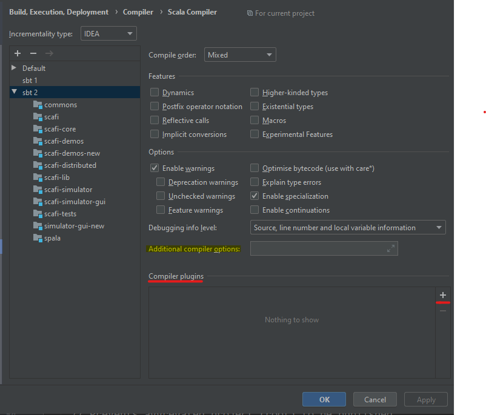

# PPS-19, Scafi compiler plugin 

This project aims to define a plugin for the scala compiler that add several checks to the DSL built in the scafi framework.

At the moment, the plugin can:
- do an higher-level typechecking, working over the scala compiler typechecking, to verify if the use of an aggregate type (Local, Field, T) is legal;
- wrap lambda in aggregate functions;
- check the legal use of the if statement in aggregate programs;
- assign a type to each aggregate function based on a known set of core functions.

To use this plugin you have to get the jar. To do this you need to clone the project and  to execute the following **sbt package** in the project root. Then, you'll find the jar in the *target/scala-2.11/* folder.

```
sbt package
```


Another way to retrieve the jar is to download it from github packages: https://github.com/cric96/PPS-19-scafi-plugin/packages

Now you have to open the scafi project, keeping attention on the scala version in use: only version 2.11.8 is supported.

You can set the plugin via **sbt** by adding the following lines in the **build.sbt** file and in the **commonSetting** variable:

```scala
lazy val commonsSetting = Seq(
 ...
   autoCompilerPlugins := true,
   scalacOptions += "-Xplugin:<path del jar>/<nome del file>.jar"  
) 

```
now, rebuilding one of the scafi modules, you should see these logs: 

```
Information: scalac:transform
Information: scalac:discover
Information: scalac:typecheck
```
It is also possible to set the plugin via intelliJ IDEA: File>Setting>Build, Execution, Deployment > Compiler > Scala Compiler.

Choose the project starting with sbt and select the jar compiler clicking on the "+" button on bottom right.



You can add a new information to the plugin writing the following line as an option to the compiler: 

```
-P:scafi:<name>:<value>
```

These are the legal name-value pairs:

- disable:* : disable all the compiler components;
- disable:error : mute errors and convert them into warnings;
- disable:transform || discover || typecheck : disable the defined compilation phase.

You have two ways to add a new option: whether via sbt, writing the chosen option in scalacOptions, or via IDEA, writing the string in "Additional compiler options".


Some useful links:

- scala official guide: https://docs.scala-lang.org/overviews/plugins/index.html
- scala compiler plugin template: https://github.com/softwaremill/scala-compiler-plugin-template
- scala compiler doc : https://www.scala-lang.org/api/2.12.3/scala-compiler/scala/tools/nsc/index.html
- quasi qoute intro : https://docs.scala-lang.org/overviews/quasiquotes/intro.html


Done by Gianluca Aguzzi

